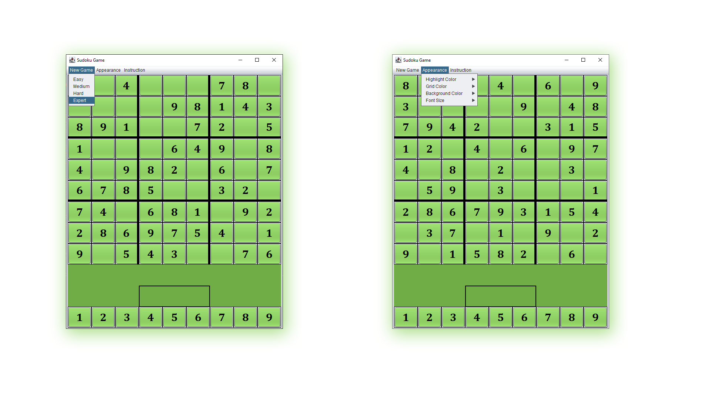
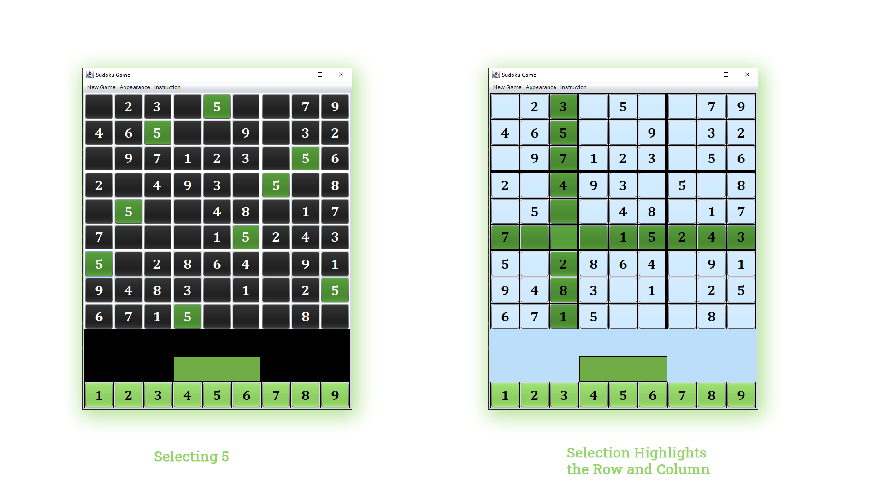
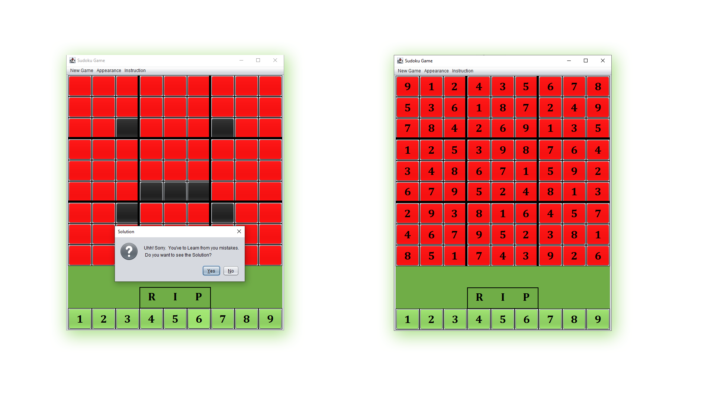
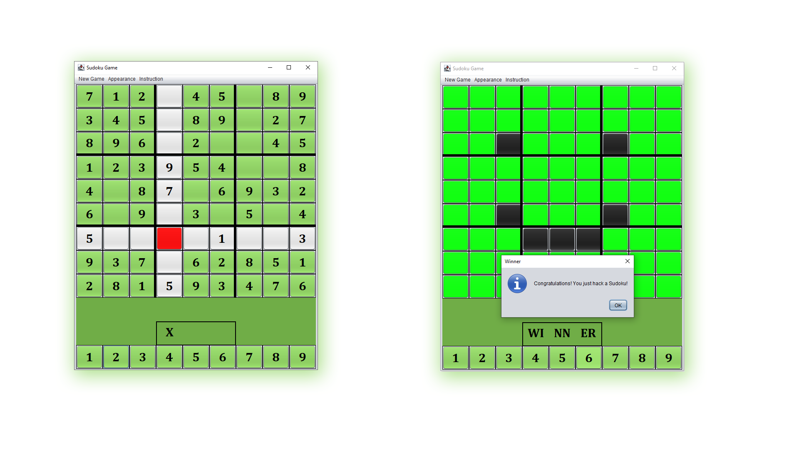

<h1 align="center"><b>Sudoku Puzzle Game</b> By Dynamic DEVs</h1>

## Features
1. There are 4 levels in this game & you can choose levels from the menu bar --> New Game--> Options
2. In the Appearance button on the menu bar, you can change the Font Size, Grid Color, Highlight Color, Background Color
3. You can see the solution if you fail to solve 3 times 

N.B. : If you choose Black color for your grid, you may change the highlight color for more comfort.

#### This Project is made using Java Swing.

Levels and Appearance

Selecting and Solving Features

Levels and Appearance

Levels and Appearance

## Team
  [Sajal Das](https://github.com/sajaldas19)  
  [Shumaiya Akter Shammi](https://github.com/Shammi179)  
  Tania Afrin Somaya  
  Md Humayun Farid  